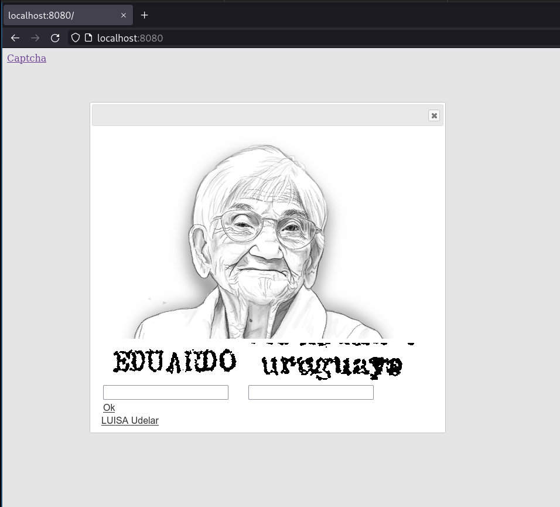
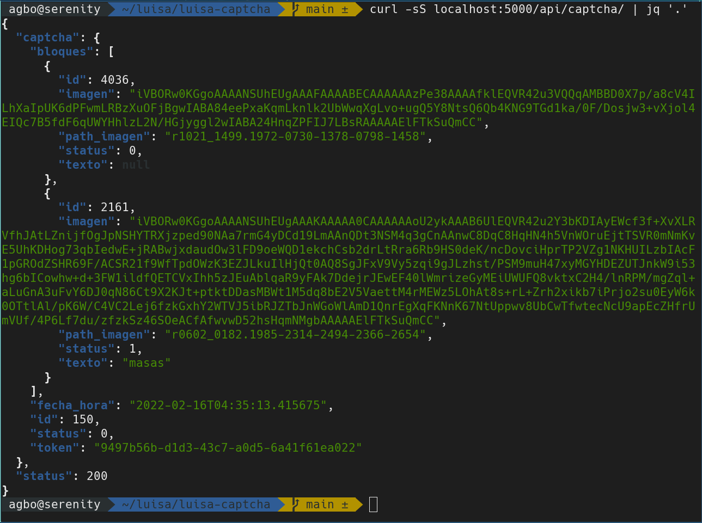

# LUISA™ Captcha Project

## Contexto
Este proyecto integra los diferentes componentes del proyecto LUISA Captcha. Para esto se incluye un archivo `docker-compose.yaml` que contiene la especificación de cada uno de los componentes. Para algunos de estos es necesario obtener su proyecto desde el repositorio correspondiente.

También se incluyen algunos scripts para facilitar el uso.

## Componentes

La solución está compuesta por varios componentes, los siguientes son:

| Contenedor | Puerto | Repositorio |
| ---------- | ------ | ----------- |
| luisa-captcha-frontend | 8080 | [github.com/luisa-uy/captcha-frontend](https://github.com/luisa-uy/captcha-frontend)|
| luisa-captcha-api | 5000 | [github.com/luisa-uy/captcha-api](https://github.com/luisa-uy/captcha-api) |
| luisa-captcha-postgres | 5432 | N/A | 

## Primera ejecución

Una vez clonado este proyecto, lo primero que se debe hacer es ejecutar el `init.sh` mediante
```
$ ./init.sh
```
Este script lo que hace es:
- Crear un archivo `.env` que tiene toda la información correspondiente a la configuración de los ambientes. Si este archivo está creado, se salta este paso.
- Clonar el proyecto `captcha-frontend` desde sus respectivo repositorio, guardándolo en el directorio especificado en la variable `$FRONT_PATH` de nuestro archivo `.env`.
- Clonar el proyecto `captcha-api`, idem al anterior pero la variable es `$API_PATH`.
- Genera los contenedores.
- Ejecutar el proyecto por primera vez.

Una vez ejecutado el script, se puede ver que ambos proyectos fueron clonados en sus directorios correspondientes, el archivo `.env` se encuentra en el directorio donde estamos parados, el directorio `data` fue creado y los procesos de docker quedaron corriendo. Estos los podemos consultar mediante `docker ps`
```
$ docker ps
CONTAINER ID   IMAGE                   COMMAND                  CREATED          STATUS         PORTS                                       NAMES
e7164d199f07   luisa-captcha_backend   "python app.py --hos…"   10 seconds ago   Up 8 seconds   0.0.0.0:5000->5000/tcp, :::5000->5000/tcp   luisa-captcha-api
a2a32b18fb9d   nginx:1.20-alpine       "/docker-entrypoint.…"   10 seconds ago   Up 9 seconds   0.0.0.0:8080->80/tcp, :::8080->80/tcp       luisa-captcha-frontend
fa5eddd67f64   postgres:14.1-alpine    "docker-entrypoint.s…"   10 seconds ago   Up 9 seconds   0.0.0.0:5432->5432/tcp, :::5432->5432/tcp   luisa-captcha-postgres
```


## Uso
Una vez ejecutado el `init.sh` y teniendo el proyecto corriendo, podemos consultar los diferentes puertos listados en la tabla anterior para acceder a los servicios correspondientes. 

### Frontend 💻
Podemos utilizar un navegador web para navegar a `localhost:8080`, esto nos va a devolver el frontend con el captcha.



### Backend 🐍
Como también consultar los endpoints de la API en `localhost:5000`



## Ejecución
Luego de la inicialización, la ejecución se gestiona mediante comandos de `docker` y `docker-compose`. Para los comandos de `docker-compose` desde la terminal, es importante estar parados sobre el directorio del proyecto, ya que `docker-compose` consulta el `docker-compose.yaml` del directorio actual.

Para levantar el proyecto, recreando las imágenes (para impactar los cambios), ejecutamos
```
docker-compose up --force-recreate --build -d
```

Como ya dijimos, para ver los procesos corriendo es con
```
docker ps
```

Para ver los logs de un contenedor en particular (incluso uno que falló) es con
```
docker logs $container_id
```

Se puede entrar a los contenedores usando
```
docker exec -it $nombre_contenedor bash
```

En caso de la base de postgres, ya podemos entrar de una con un shell de `psql` mediante
```
docker exec -it luisa-captcha-postgres psql -U$POSTGRES_USER -d$POSTGRES_DATABASE 
```

Finalmente, terminamos la ejecución con
```
docker-compose down
```

## Dependencias

- bash
- git
- docker
- docker-compose

## Errores comunes

### `luisa-captcha-api` no aparece luego de inicializar el proyecto
Puede suceder que al inicializar el proyecto, el contenedor `luisa-captcha-api` no aparezca en el `$ docker ps`. 
Esto puede suceder porque por diseño docker-compose no tiene como esperar que un contenedor tenga cierto "estado" (como por ejemplo, tener una aplicación corriendo en un determinado puerto) para después ejecutar el próximo. Esto nos genera una race condition entre la base de datos y el backend, ya que el backend falla si no encuentra la base corriendo en el puerto en el momento en el que este se inicializa.  
Volver a correr `docker compose up -d` con la base corriendo soluciona ese problema.

### `docker` y `docker-compose` devuelven error de permisos
Ambos comandos requieren acceso al daemon de `docker`, el cual requiere de privilegios de super usuario 🦸. La forma más común sería agregar `sudo` antes de cada uno de los comandos.  
También es posible agregar el usuario acutual al grupo `docker` para evitar elevar privilegios cada vez.